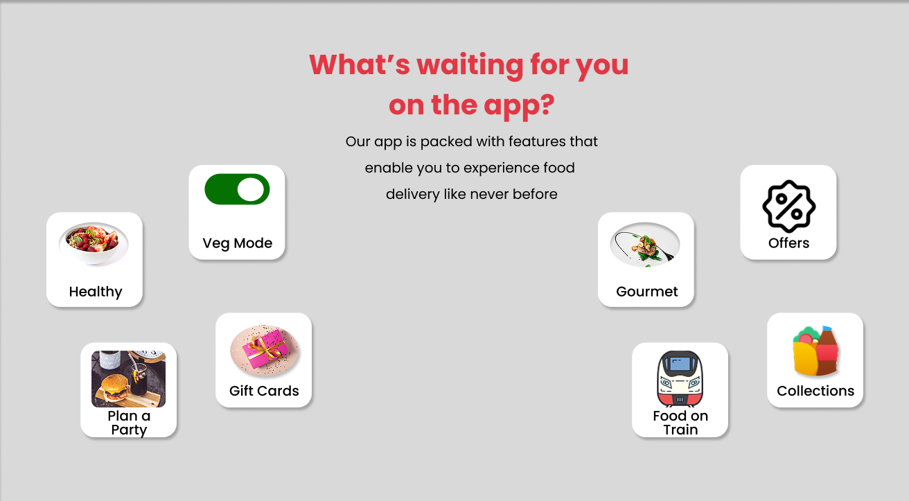

# 🍽️ Zomato Clone – Figma Design Screens

This is a UI/UX redesign experiment cloning Zomato’s landing page using **Figma Desktop**.  
The designs reflect the structure and branding of Zomato's homepage and value proposition.

---

## 📂 Files Included

| File | Description |
|------|-------------|
| `hero-screen.png` | First screen: Hero section with branding, CTA buttons, and background GIF (static preview). |
| `hero-background.gif` | Animated background used in the Figma hero section. Plays in prototype only. |
| `about-screen.png` | Second screen: "Better food for more people" — Zomato’s mission section. |

---

### 🔧 Tools Used
- 🧩 Figma Desktop App
- 🎨 Font: Poppins
- 📁 Exported as PNG + GIF assets

- ## 📱 Phone Animation Section

This section mimics the Zomato animation where the phone appears after a delay.

### 🟣 Step 1: Before the phone appears

### 🔵 Step 2: After the phone appears

